# Optimización y Accesibilidad en React

---

## A) Optimización de imágenes en React

### Identificación de la imagen que más impacta el LCP
De acuerdo con el reporte generado mediante **Lighthouse**, la imagen que más impacta el **LCP (Largest Contentful Paint)** es el **banner** como se muestra a continuación:

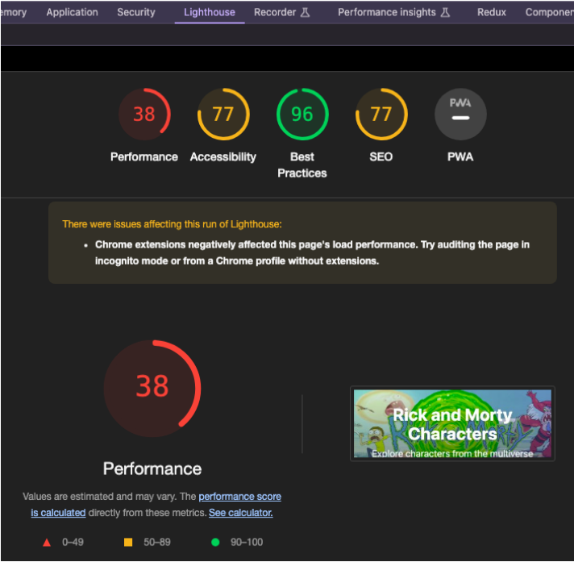

---

### Estrategias aplicadas
Para imágenes críticas, utiliza **preload** y **srcset** para una carga eficiente.

Utilizando inteligencia artificial para dar las instrucciones respectivas, se realizan los siguientes cambios:

- Se crea un nuevo componente `PreloadImage` que maneja la carga prioritaria de las imágenes.

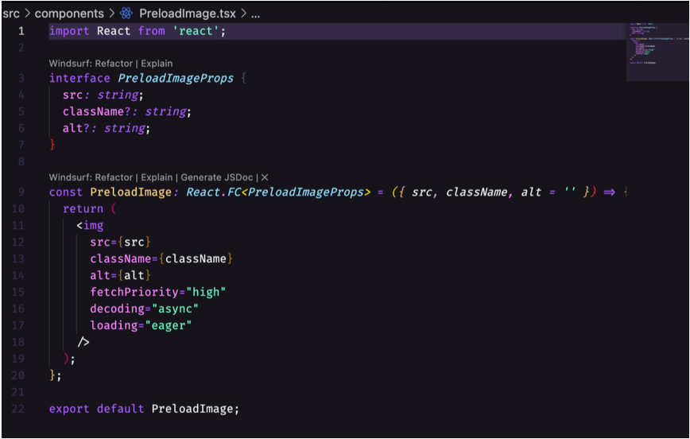

- Se usa el componente creado previamente en las imágenes del **header** y **footer** con `fetchPriority="high"`.

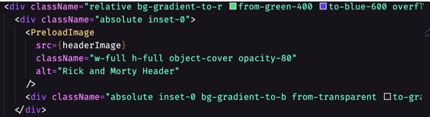

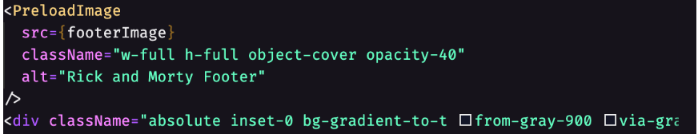

- Para imágenes no críticas, se aplica **lazy-load**.

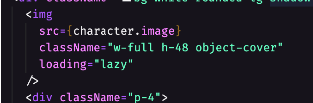

---

### Resultados
Ejecuta Lighthouse antes/después evidencias (capturas/url).

Con los cambios aplicados por la inteligencia artificial se obtiene la siguiente **mejora de rendimiento**:

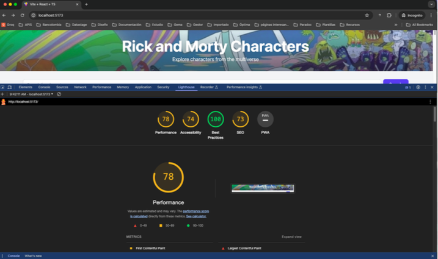

---

## B) Usabilidad y Accesibilidad con react-i18next

### Implementación

Se ajusta la aplicación para que detecte el idioma y que se pueda cambiar a otro idioma usando **react-i18next**.

### Archivos creados

- Se crean los archivos de traducción (`es.json`, `en.json`).

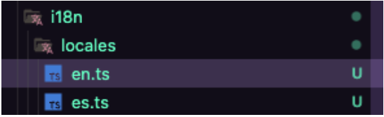

- Se crea el siguiente componente para la opción de selector de idiomas:

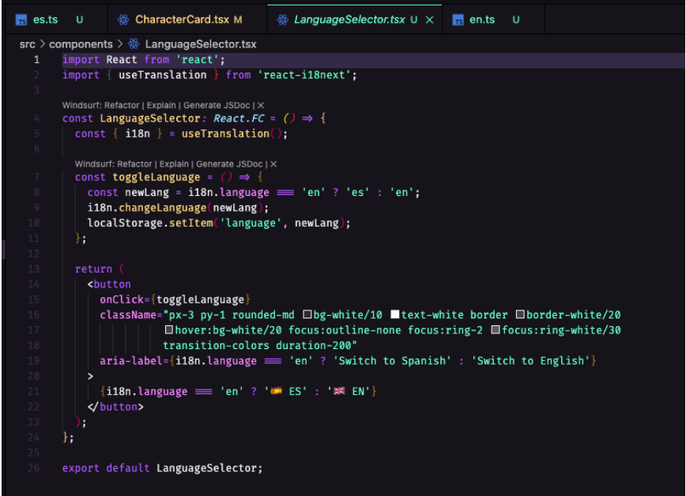

---

### Componentes actualizados

Se actualizan los componentes:

- `App.tsx`
- `CharacterCard.tsx`
- `SearchBar.tsx`

Ejemplo de uso de traducción:

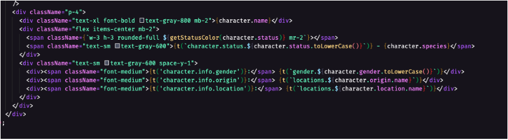

---

### Resultado visual

Finalmente, la página en español se ve así:  

Y la página en inglés, así:  

La opción para realizar las traducciones se visualiza en la esquina derecha:  

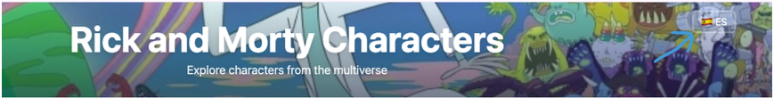

---

## C) Pruebas con Jest - 3 pruebas nuevas

### Enunciado

Escriba tres pruebas adicionales (pueden ser unitarias o de integración ligera):

1. Servicio con HTTP: caso de éxito (y opcional error) verificando método/URL y respuesta simulada.

2. Se agregan estos dos test:

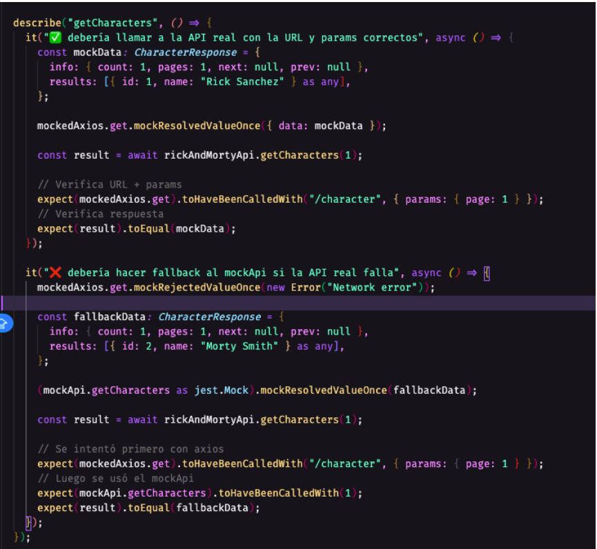

3. Finalmente, solo se pudo correr esta cantidad de pruebas por el desconocimiento en el lenguaje.

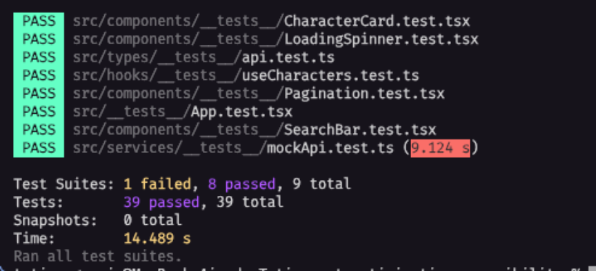 

---

## Conclusiones

- Se mejoró el **rendimiento del LCP** optimizando imágenes críticas y no críticas.
- Se implementó **internacionalización (i18n)** con soporte para español e inglés.
- Se añadieron pruebas unitarias e integración con **Jest**, fortaleciendo la cobertura de calidad del código.

---