Reto tecnico - optimizacion, i18n (a11y) y pruebas con jest en react

a)  Identifica la imagen que más impacta el LCP de la vista inicial.
• Ejecutamos lighthouse
 

• Identifica la imagen que más impacta el LCP de la vista inicial.
 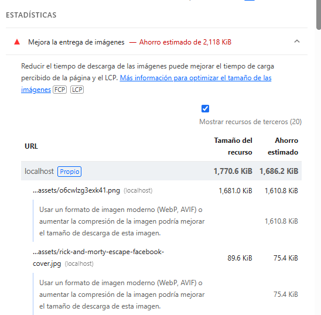

• Revisamos la imagen que mas impacta en lighthouse
 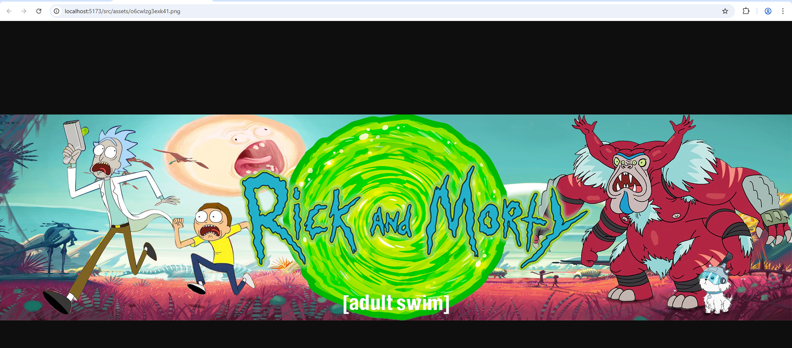

• Entramos al codigo donde esta la imagen
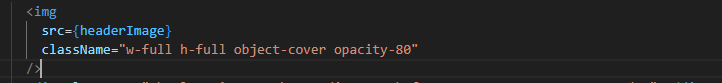

Cambiamos el codigo para imementar preload y srcset para darle una carga mas eficiente
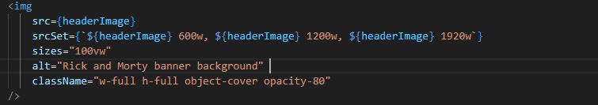

Ejecutamos nuevamente Lighthouse
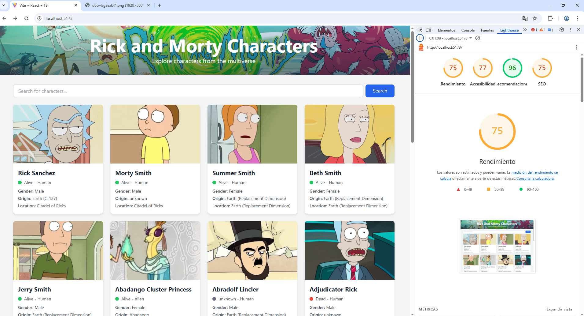

• Para imágenes no críticas, aplica lazy-load. Validamos las imágenes no criticas (En este caso las imagenes no criticas son las cartas)
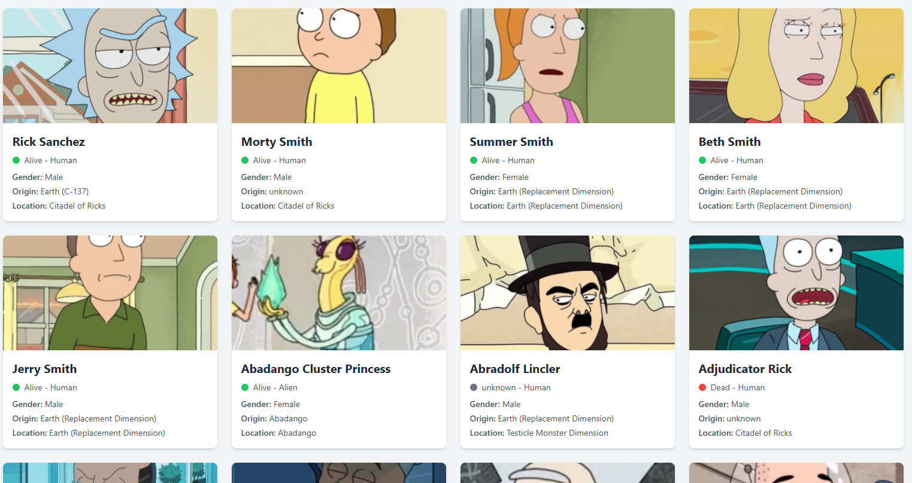

Identificamos que las cartas ya tienen lazy-load
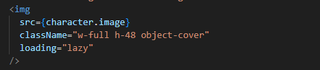

Revisamos el codigo para la imagen que tenemos en el footer
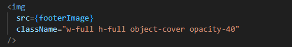

Aplicamos lazy-load
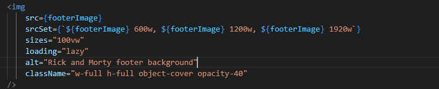

• Ejecutamos nuevamente Lighthouse
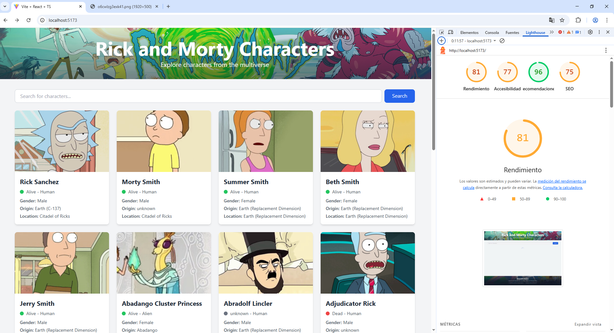

b) Ajusta la aplicación para que detecte el idioma y que se pueda cambiar a otro idioma 
usando react-i18next

Instalamos React-i18next
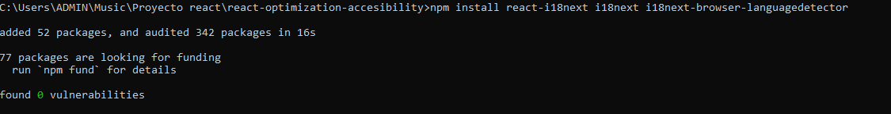

Creamos el archivo en la ruta SRC/i18n.ts para hacer las traducciones
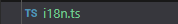

Hacemos la traduccion de aquellos testos que se encuentran en la pagina tanto en ingles como en español
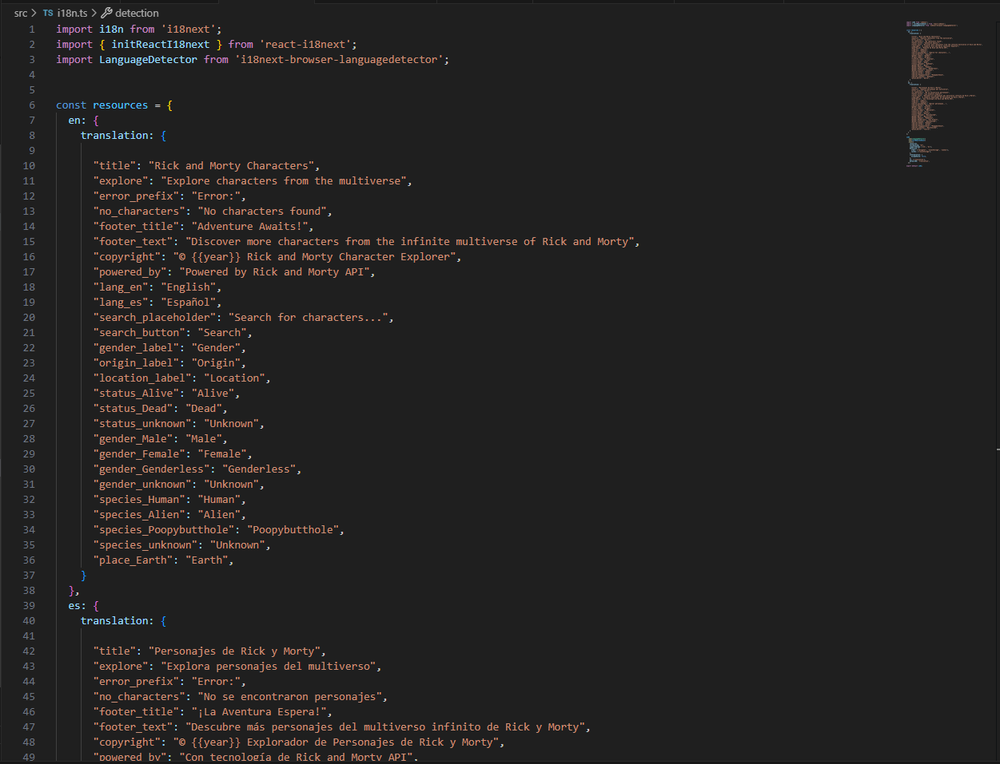

Creamos 2 botones en el App.tsx para poder cambiar entre idiomas
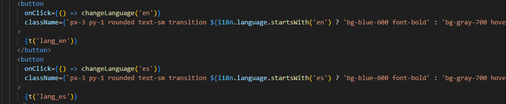

Miramos como se ve la pagina en ingles
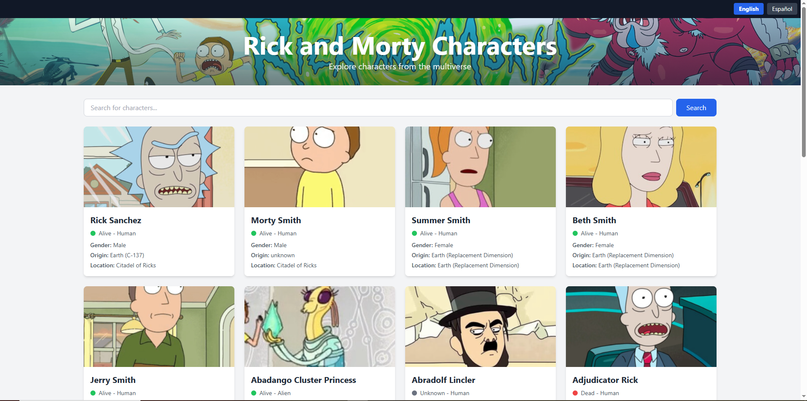

Miramos como se ve la pagina en español

c) Pruebas con Jest:
- 1 Servicio con HTTP: caso de éxito (y opcional error) verificando método/URL y 
respuesta simulada. 
Instalamos Jest
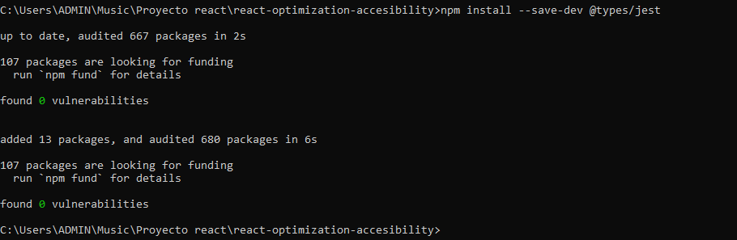

Creamos el archivo jest.config 
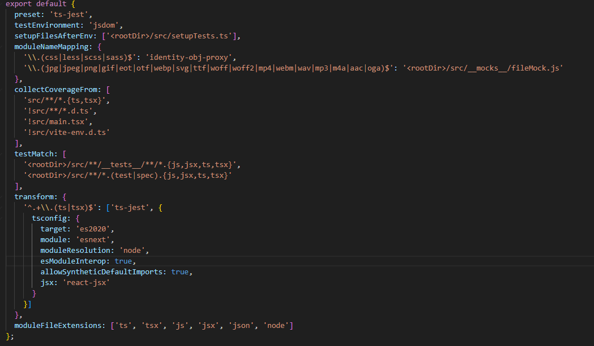
Creamos el archivo setup.test
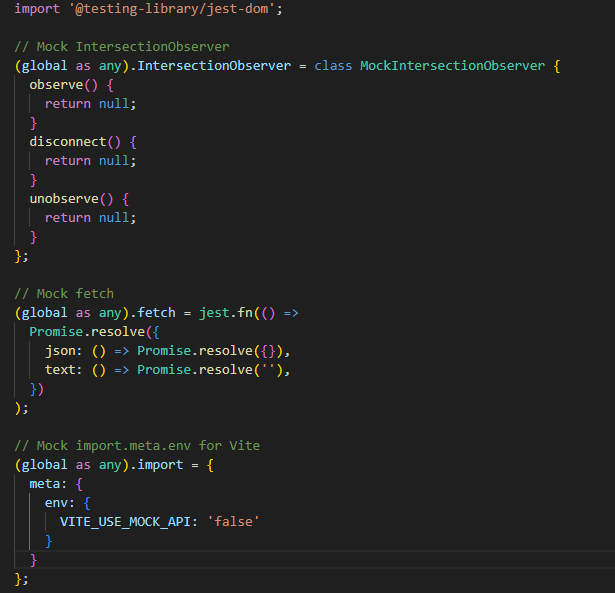

Creamos el archivo rickandmortyApi.test.ts
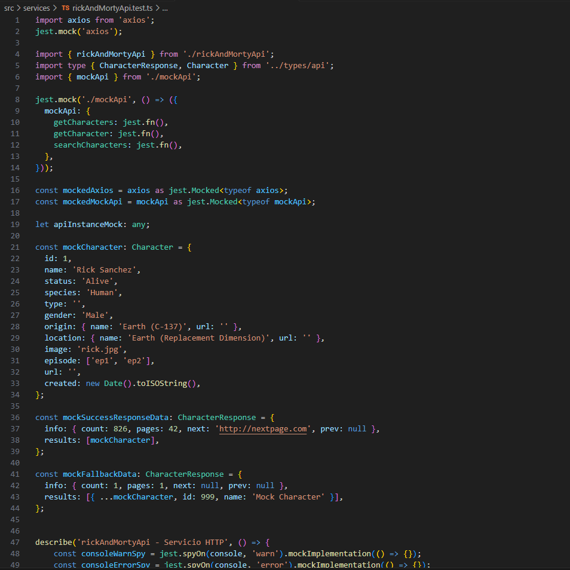

Añadimos el primer escenario para de exito
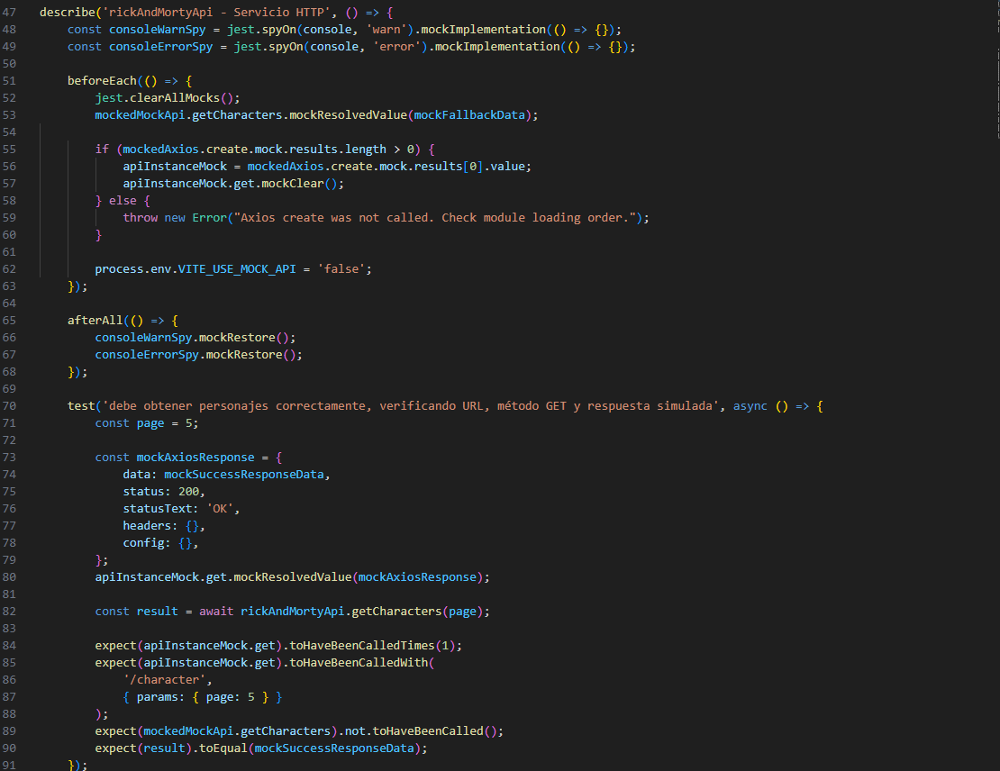

Añadimos el escenario opcional:
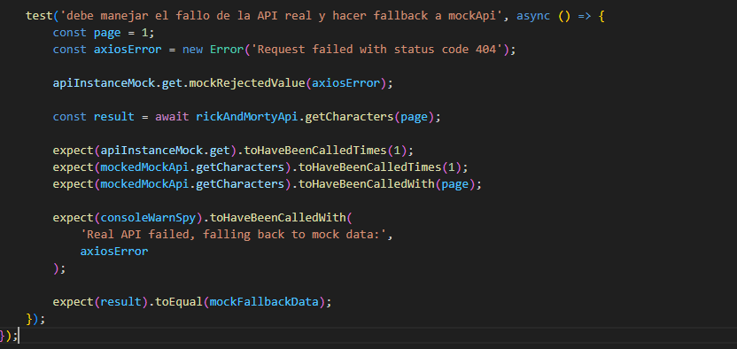

Ejecutamos npm test
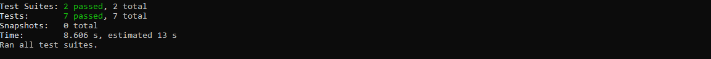

- 2 Componente: interacción del usuario y verificación del DOM con selectores 
accesibles.  
Creamos el archivo SearchBar.test.tsx con la prueba debe obtener personajes correctamente, verificando URL, método GET y respuesta simulada
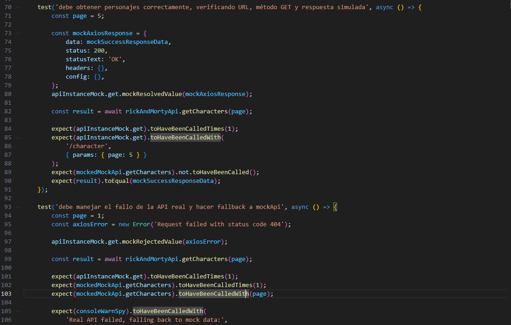

Ejecutamos npm test
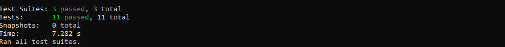
- 3 Integración ligera: componente + servicio + HTTP mock. 
Creamos el archivo characterlist.integration.test.tsx
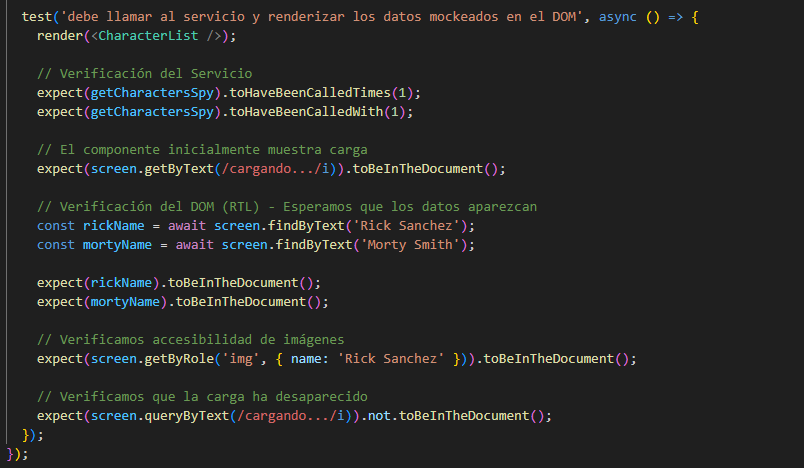
Ejecutamos npm test
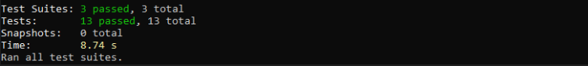