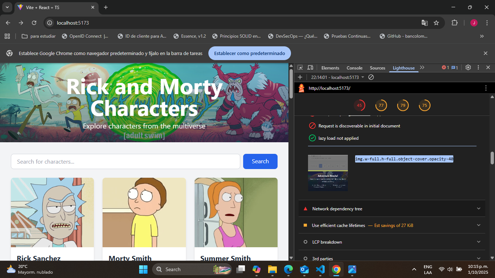
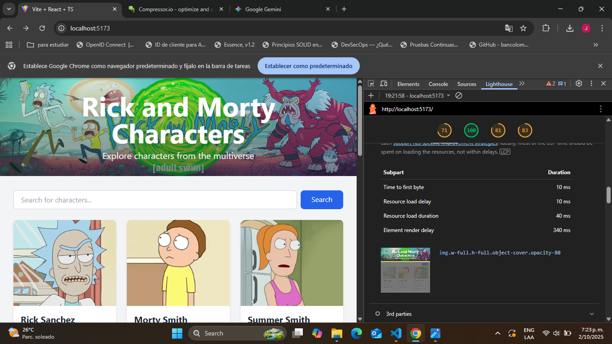

# React + TypeScript + Vite

This template provides a minimal setup to get React working in Vite with HMR and some ESLint rules.

Currently, two official plugins are available:

- [@vitejs/plugin-react](https://github.com/vitejs/vite-plugin-react/blob/main/packages/plugin-react) uses [Babel](https://babeljs.io/) for Fast Refresh
- [@vitejs/plugin-react-swc](https://github.com/vitejs/vite-plugin-react/blob/main/packages/plugin-react-swc) uses [SWC](https://swc.rs/) for Fast Refresh

## Expanding the ESLint configuration

If you are developing a production application, we recommend updating the configuration to enable type-aware lint rules:

```js
export default defineConfig([
  globalIgnores(['dist']),
  {
    files: ['**/*.{ts,tsx}'],
    extends: [
      // Other configs...

      // Remove tseslint.configs.recommended and replace with this
      tseslint.configs.recommendedTypeChecked,
      // Alternatively, use this for stricter rules
      tseslint.configs.strictTypeChecked,
      // Optionally, add this for stylistic rules
      tseslint.configs.stylisticTypeChecked,

      // Other configs...
    ],
    languageOptions: {
      parserOptions: {
        project: ['./tsconfig.node.json', './tsconfig.app.json'],
        tsconfigRootDir: import.meta.dirname,
      },
      // other options...
    },
  },
])
```

You can also install [eslint-plugin-react-x](https://github.com/Rel1cx/eslint-react/tree/main/packages/plugins/eslint-plugin-react-x) and [eslint-plugin-react-dom](https://github.com/Rel1cx/eslint-react/tree/main/packages/plugins/eslint-plugin-react-dom) for React-specific lint rules:

```js
// eslint.config.js
import reactX from 'eslint-plugin-react-x'
import reactDom from 'eslint-plugin-react-dom'

export default defineConfig([
  globalIgnores(['dist']),
  {
    files: ['**/*.{ts,tsx}'],
    extends: [
      // Other configs...
      // Enable lint rules for React
      reactX.configs['recommended-typescript'],
      // Enable lint rules for React DOM
      reactDom.configs.recommended,
    ],
    languageOptions: {
      parserOptions: {
        project: ['./tsconfig.node.json', './tsconfig.app.json'],
        tsconfigRootDir: import.meta.dirname,
      },
      // other options...
    },
  },
])
```

## Optimizaciones de Rendimiento de Imágenes

Se implementaron varias estrategias de optimización para mejorar el LCP (Largest Contentful Paint) y la experiencia de usuario general, enfocándose en las imágenes del encabezado y del pie de página.

### Imagen del Encabezado (Elemento LCP)

Para la imagen principal del encabezado, que es el elemento LCP más importante, se aplicaron las siguientes técnicas:

- **Preload**: Se añadió `<link rel="preload">` en el `index.html` para indicarle al navegador que comience a descargar esta imagen con alta prioridad lo antes posible, sin esperar a que se analice el resto del DOM.
- **Fetch Priority**: Se utilizó el atributo `fetchPriority="high"` en la etiqueta `` como una señal adicional para que el navegador priorice su descarga.
- **Async Decoding**: Se incluyó `decoding="async"` para permitir que el navegador decodifique la imagen fuera del hilo principal, reduciendo el bloqueo del renderizado.
- **Srcset y Sizes**: Aunque solo se dispone de una versión de la imagen, se añadieron los atributos `srcset` y `sizes` para informar al navegador sobre el tamaño real de la imagen y cómo se mostrará en el viewport. Esto le permite optimizar la asignación de recursos de manera más eficiente.

### Imagen del Pie de Página (Elemento Below-the-fold)

Para la imagen del pie de página, que no es visible al cargar la página, la estrategia fue diferente:

- **Lazy Loading**: Se implementó el atributo `loading="lazy"`, que le indica al navegador que difiera la descarga de esta imagen hasta que el usuario se desplace cerca de ella. Esto ahorra ancho de banda durante la carga inicial y acelera el renderizado del contenido visible.

### Resultados

A continuación se muestra una comparación del rendimiento antes y después de las optimizaciones.

**Antes:**




**Después:**



## Soporte Multi-idioma

El proyecto utiliza `i18next` y `react-i18next` para gestionar la internacionalización y ofrecer una experiencia multi-idioma.

### Configuración

La configuración principal se encuentra en `src/i18n.ts`. Los puntos clave son:

- **Backend HTTP**: Se usa `i18next-http-backend` para cargar los archivos de traducción de forma asíncrona desde el servidor.
- **Traducciones Precargadas**: Para optimizar la carga inicial, las traducciones en inglés (`en`) están directamente incrustadas en la configuración, evitando una solicitud de red para el idioma por defecto.
- **Estructura de Archivos**: Las traducciones se organizan en `public/locales/{idioma}/translation.json`.

### Uso

Para usar las traducciones dentro de un componente de React, se utiliza el hook `useTranslation`:

```jsx
import { useTranslation } from 'react-i18next';

const MyComponent = () => {
  const { t } = useTranslation();

  return <h1>{t('welcomeMessage')}</h1>;
};
```

## Pruebas Unitarias

Se implementaron dos pruebas clave para asegurar la calidad y el correcto funcionamiento de la aplicación.

### Prueba Unitaria para `rickAndMortyApi`

**Objetivo:** Verificar que el servicio que consume la API de Rick and Morty construye y ejecuta las llamadas a bajo nivel (usando `axios`) de forma correcta.

Esta prueba simula `axios` para aislar el servicio. Se asegura de que al llamar a `getCharacter(1)`, el servicio internamente intenta contactar el endpoint correcto (`/character/1`).

```javascript
// src/services/__tests__/rickAndMortyApi.test.ts
it('should fetch a single character successfully', async () => {
  // Arrange
  const characterId = 1;
  const mockCharacter: Character = {
    id: 1,
    name: 'Rick Sanchez',
    status: 'Alive',
    species: 'Human',
    type: '',
    gender: 'Male',
    origin: { name: 'Earth (C-137)', url: 'https://rickandmortyapi.com/api/location/1' },
    location: { name: 'Citadel of Ricks', url: 'https://rickandmortyapi.com/api/location/3' },
    image: 'https://rickandmortyapi.com/api/character/avatar/1.jpeg',
    episode: ['https://rickandmortyapi.com/api/episode/1'],
    url: 'https://rickandmortyapi.com/api/character/1',
    created: '2017-11-04T18:48:46.250Z',
  };
  
  mockGet.mockResolvedValue({ data: mockCharacter });

  // Act
  const result = await rickAndMortyApi.getCharacter(characterId);

  // Assert
  expect(mockGet).toHaveBeenCalledTimes(1);
  expect(mockGet).toHaveBeenCalledWith(`/character/${characterId}`);
  expect(result).toEqual(mockCharacter);
});
```

### Prueba de Integración para `App`

**Objetivo:** Simular un flujo de usuario completo para garantizar que múltiples componentes (`SearchBar`, `CharacterList`, `Pagination`) interactúan correctamente.

Esta prueba verifica el siguiente escenario:
1.  Un usuario realiza una búsqueda.
2.  Los resultados correctos aparecen en pantalla.
3.  El usuario navega a la siguiente página de resultados.
4.  La lista se actualiza para mostrar los nuevos resultados.

```javascript
// src/__tests__/App.test.tsx
it('should allow searching and then paginating through results', async () => {
  const user = userEvent.setup();

  // Mock responses
  const initialResponse = { info: { count: 0, pages: 0, next: null, prev: null }, results: [] };
  const searchResponsePage1 = {
    info: { count: 2, pages: 2, next: 'page2', prev: null },
    results: [{ id: 1, name: 'Rick Sanchez', status: 'Alive' as const, species: 'Human', gender: 'Male' as const, origin: { name: 'Earth (C-137)', url: '' }, location: { name: 'Citadel of Ricks', url: '' }, image: '', episode: [], url: '', created: '' }],
  };
  const searchResponsePage2 = {
    info: { count: 2, pages: 2, next: null, prev: 'page1' },
    results: [{ id: 8, name: 'Adjudicator Rick', status: 'Dead' as const, species: 'Human', gender: 'Male' as const, origin: { name: 'unknown', url: '' }, location: { name: 'Citadel of Ricks', url: '' }, image: '', episode: [], url: '', created: '' }],
  };

  // Setup mock call sequence
  mockedApi.getCharacters.mockResolvedValue(initialResponse);
  mockedApi.searchCharacters
    .mockResolvedValueOnce(searchResponsePage1) // First call for search
    .mockResolvedValueOnce(searchResponsePage2); // Second call for pagination

  render(<App />);

  // 1. Perform search
  const searchInput = screen.getByPlaceholderText('Search for characters...');
  const searchButton = screen.getByText('Search');
  await user.type(searchInput, 'Rick');
  await user.click(searchButton);

  // 2. Verify first page of search results
  await waitFor(() => {
    expect(screen.getByText('Rick Sanchez')).toBeInTheDocument();
  });
  expect(mockedApi.searchCharacters).toHaveBeenCalledWith('Rick', 1);

  // 3. Paginate to the next page
  const nextButton = screen.getByText('Next');
  await user.click(nextButton);

  // 4. Verify second page of search results
  await waitFor(() => {
    expect(screen.getByText('Adjudicator Rick')).toBeInTheDocument();
  });
  expect(screen.queryByText('Rick Sanchez')).not.toBeInTheDocument();
  expect(mockedApi.searchCharacters).toHaveBeenCalledWith('Rick', 2);
  expect(mockedApi.searchCharacters).toHaveBeenCalledTimes(2);
});
```-jest`) para ser solucionada.